星火·链网骨干节点接入开发规范

| **文档名称** | **星火·链网骨干节点接入开发规范** |
|--------------|-----------------------------------|
| 版本         | V1.0.4                            |
| 时间         | 2021-11-08                        |

# 文档修订记录

| **日期**   | **版本** | **说明**                                                                                                           | **作者** |
|------------|----------|--------------------------------------------------------------------------------------------------------------------|----------|
| 2021-07-08 | V1.0.0   |                                                                                                                    |          |
| 2021-08-11 | V1.0.1   | 调整目录 修改骨干节点接入流程图，标记区分线上流程和线下流程 补充跨链数据流时序图 补充3.1接入内容，明确初期接入内容 |          |
| 2021-09-01 | V1.0.2   | 补充注册申请流程说明                                                                                               |          |
| 2021-10-12 | V1.0.3   | 补充超级节点开放平台API文档在线地址、更新参考章节编号                                                              |          |
| 2021-11-08 | V1.0.4   | 更新骨干节点接入流程图，红色标记超级节点操作内容 更新业务系统访问地址 更新骨干节点接入-注册申请流程截图            |          |
| 2021-11-16 | V1.0.5   | 1、更新BID解析协议线上地址                                                                                         |          |

# 1 前言

文档目的：指导骨干节点/骨干链接入，包含接入流程、接入内容和开发规范。接入方式**先通过星火·链网超级节点测试网络平台进行测试验证**，接入测试成功后再接入超级节点正式系统。

**测试系统：** 超级节点测试网络平台地址：http://test-boss.bitfactory.cn/

**生产系统：** 超级节点区块链网络平台地址：https://boss.bitfactory.cn/

参考文档：[《星火·链网超级节点开放平台API》](https://bif-open-api-doc.readthedocs.io/zh_CN/latest/index.html)、[《BID协议》](https://bid-resolution-protocol-doc.readthedocs.io/zh_CN/v1.9.1/)

# 2 通用说明

## 2.1 名词解释

**API_key：** 开发者的身份ID，可用于获取骨干节点的调用凭证（access_token），然后通过接口调用凭证再来访问开放平台API。

**API_secret：** 开发者身份ID对应的密钥，配合API_key使用能够获取接口调用凭证，同时为了安全起见这个密钥需要妥善保管。

**accessToken：** 所有API接口的调用凭证，通过API_key和API_secret调用相关接口获得，具有时效性，有效时间为2小时，
过期后需要重新获取否则会调用接口失败，因为凭证获取的接口有调用次数限制，所以建议妥善保存并管理。

**AC号：** 自治共识域为边界的跨链互通能力（ACSN，Autonomous Consensus System
Number），简称共识域号，即AC号，AC号是由四位小写字母和数字组成，代表各区块链在星火·链网中唯一合法身份，是星火·链网体系中区分不同区块链共识区域的代号，用于区块链身份识别及全网寻址功能。

**BID：** 区块链上标记某个对象唯一分布式标识。

**publicKey、privateKey：** 公钥和私钥是建立在区块链网络上不可缺少的组成部分，链上发起交易都是需要私钥来签名的。私钥可以恢复公钥，但是，仅使用公钥是不可能找到私钥的。

**blob：** 星火·链网上交易结构序列化后的十六进制格式，用于执行上链操作。

**backboneNodeBid：** 骨干节点BID，成为骨干节点时 可以登录星火链网
业务管理平台查看骨干节点BID。

**gatewayAddress：** 网关节点账户bid，骨干节点为下属子链上报信息时，需要使用这个账户发起交易。

**跨链合约：**  部署跨链合约后可支持主链积分转移、子链积分转移、数据跨链、智能合约跨链互操作功能。

**网关节点地址**： 子链将数据通过链网关账户锚定到国家主链。

**服务商：** 是指经有效申请并通过星火市场验证，入驻星火·链网星火市场，并通过星火市场向用户进行在线销售服务的企业。

**应用服务：** 是指服务商在星火市场发布的应用类服务，用户购买后可以通过已购服务列表中授权BID后直接访问服务商提供的外部系统或平台。

**开发服务：** 是指服务商在星火市场发布的开发类服务，如提供多维度的区块链软件能力、行业解决方案，为企业实现一站式区块链业务赋能。开发服务目前可支持API类和交付类两大分类。

**服务调用剩余时长：** 是指用户在星火市场上购买设置按时计费的API类开发服务，在已购服务详情中可以查看该服务的剩余时长。

**服务调用剩余次数：** 是指用户在星火市场上购买设置按次计费的API类开发服务，在已购服务详情中可以查看该服务的剩余次数。

## 2.2 BID-SDK-JAVA使用说明

首先下载BID-SDK-JAVA,下载地址 https://github.com/CAICT-DEV/BID-SDK-JAVA

**（1）生成区块链账户(地址、公钥、私钥）私钥需要自己妥善保管**

使用SDK生成账户示例：

```java
SDK bidSdk = new SDK();

KeyPairEntity kaypairEntity = bidSdk.getBidAndKeyPair();

String publicKey = kaypairEntity.getPublicKey();

String privateKey = kaypairEntity.getPrivateKey();

String bid = kaypairEntity.getBid();
```

**（2）如果账户需要向链上发起交易，需要账户私钥进行签名**，签名示例：

```java
SDK bidSdk = new SDK();

byte[] signByte =
bidSdk.signBlob(privateKey,HexFormatUtil.hexStringToBytes(blob));

String signBlob = HexFormat.byteToHex(signByte);
```

# 3 骨干节点接入

## 3.1 接入内容及流程

### 3.1.1 接入内容

骨干节点需根据本文档及《星火·链网超级节点开放平台API》、《BID协议》要求开发接入主链，将骨干节点及其子链信息同步至主链锚定，实现与主链的互联互通，并且在实际业务中应用BID。为实现以上目标，至少需要接入以下内容：

1.  注册申请：包含企业账号注册、获取数字身份、可信认证申请、骨干节点申请、API调用权限申请。需要登录到超级节点业务系统中进行操作，参考本文档3.3节注册申请。

2.  底层链锚定：包含链基础信息同步、链状态信息同步、链节点信息同步、链的区块信息同步、合约信息同步、交易信息同步。参考本文档3.3节开发规范、《星火·链网超级节点开放平台APIV1.5.2》中[底层链锚定章节](https://bif-open-api-doc.readthedocs.io/zh_CN/latest/docs/API%E6%8E%A5%E5%8F%A3/4-%E5%BA%95%E5%B1%82%E9%93%BE%E9%94%9A%E5%AE%9A.html)进行开发。
    
3.  同步业务数据：同步链上业务统计数据。由于不同链上业务数据不同，需提前和信通院沟通确定同步的数据字段。参考《星火·链网超级节点开放平台APIV1.5.2》中[链应用服务信息同步](https://bif-open-api-doc.readthedocs.io/zh_CN/latest/docs/API%E6%8E%A5%E5%8F%A3/3-%E5%BA%95%E5%B1%82%E9%93%BE%E4%B8%9A%E5%8A%A1%E6%8E%A5%E5%85%A5.html#id12)接口实现。
    
4.  BID标识应用于实际业务：

-   标识注册、标识解析。参考本文档3.3节开发规范、《星火·链网超级节点开放平台APIV1.5.2》中[标识注册](https://bif-open-api-doc.readthedocs.io/zh_CN/latest/docs/API%E6%8E%A5%E5%8F%A3/1-BID%E6%A0%87%E8%AF%86%E5%BA%94%E7%94%A8.html#id1)、[标识解析](https://bif-open-api-doc.readthedocs.io/zh_CN/latest/docs/API%E6%8E%A5%E5%8F%A3/1-BID%E6%A0%87%E8%AF%86%E5%BA%94%E7%94%A8.html#id3)及《BID协议V1.9.1》进行开发。
    
-   将BID标识应用于当前的业务中。由于不同骨干节点/骨干链上业务不同，需和信通院详细沟通，可能需要对骨干链上现有业务进行改造。

**说明：**

-   **以上4部分内容全部接入后即对接成功，测试环境对接成功后才可接入生产环境**。

-   除以上内容，**3.3开发规范中的其他内容可视需求进行接入**，比如跨链、服务共享、数据共享等。

-   骨干节点接入时，需要参考《星火·链网超级节点开放平台APIV1.5.2》、《BID协议V1.9.1》，**请确认拿到的文档为最新版。**

### 3.1.2 接入流程

骨干节点接入主链分为**线上注册申请**和**线下开发**两部分内容，具体流程如下图所示，蓝色标记部分需要骨干节点登录超级节点业务系统进行操作：

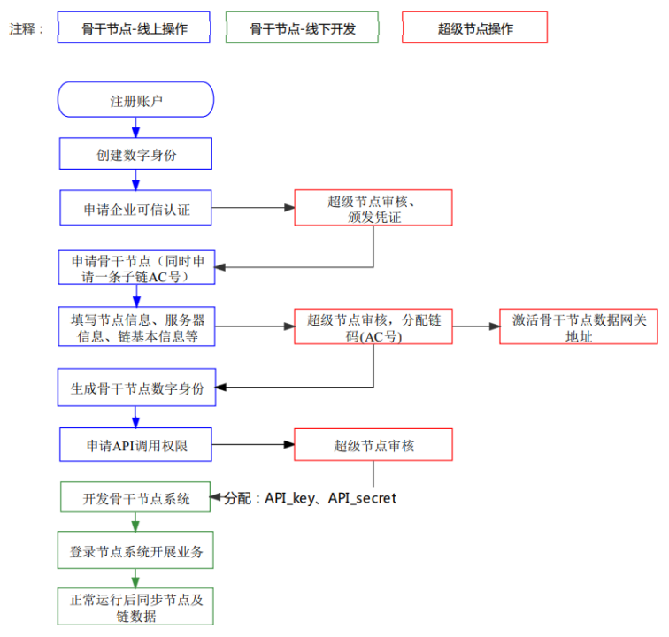

## 3.2 注册申请

### 3.2.1 注册企业账号

第一步：访问星火·链网业务系统
注册**企业账户**。（用户想要接入哪个超级节点，就登录该超级节点系统执行申请操作）

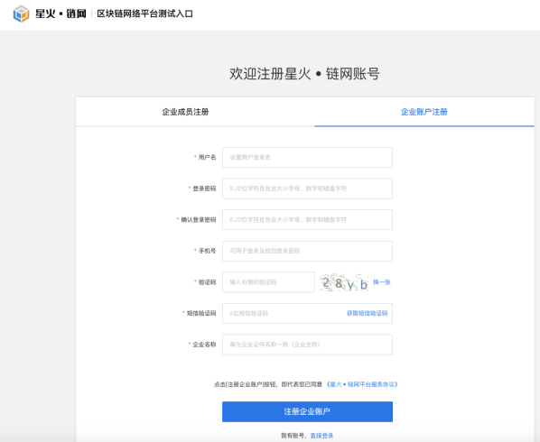

第二步：登录后，进入账户中心 获取数字身份

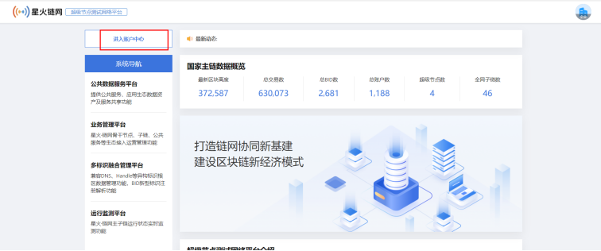

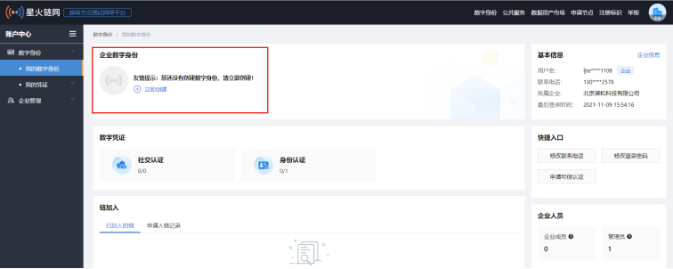

第三步：完成企业可信认证申请，申请完成后，等待所属超级节点审核企业可信认证，审核通过后，才能进行下一步申请骨干节点。

说明：测试期间，授权书等资料不需要上传真实文件。

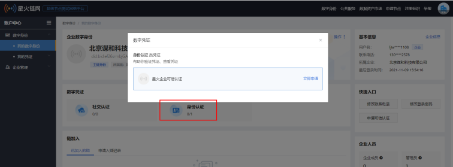

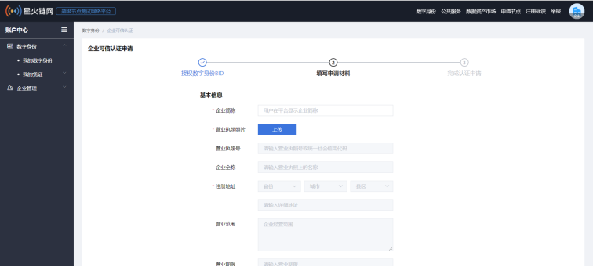

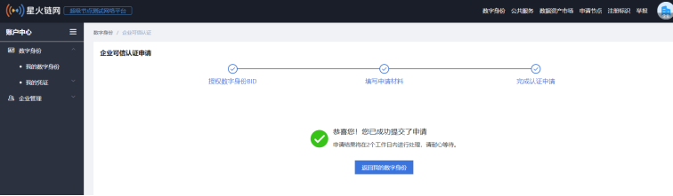

完成可信认证后，可查看证书：

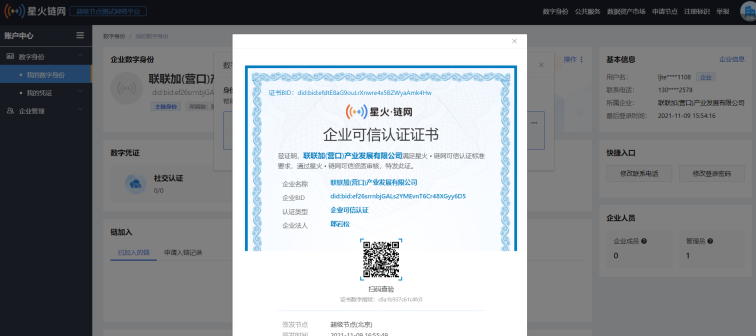

### 3.2.2 申请骨干节点

准备工作：使用BID-SDK-JAVA线下生成一个网关账户地址（公钥私钥也要保存好），为下一步申请成为骨干节点时配置接入网关地址时使用（可以生成多个）

第一步：申请骨干节点，登录星火·链平台选择业务管理平台，节点管理--节点申请--申请骨干节点；
申请完成后，等待所属超级节点审核；审核通过后才能进行下一步操作。（准备工作中生成的网关地址写到服务器信息的“链网关BID列表中”）

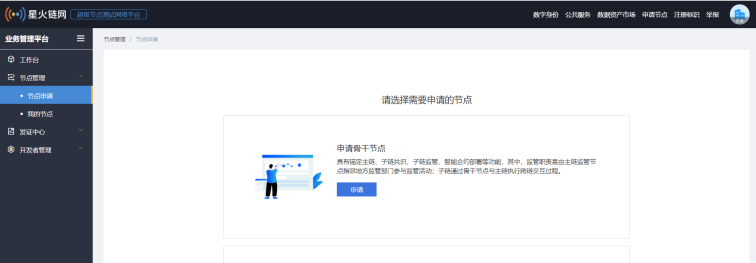

说明：

-   AC号：可自定义，最终以超级节点审核结果为准（超级节点审核时可修改AC号）

-   解析服务网络地址：目前测试没要求

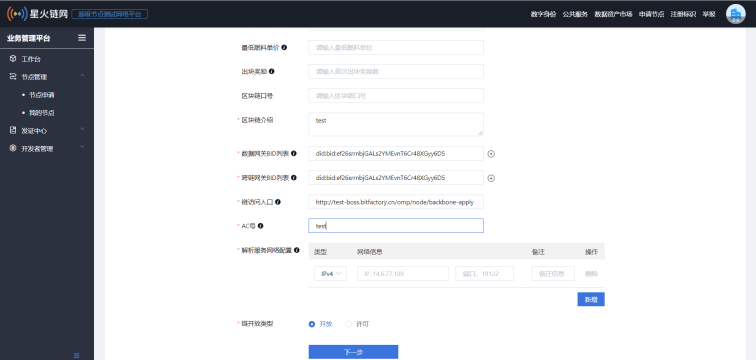

第二步：导出骨干节点账户（地址、私钥）为后续骨干节点向主链发交易时使用

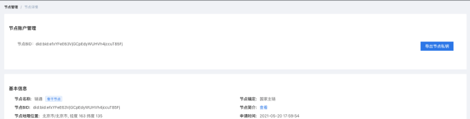

超级节点审核完成后，即生成骨干节点账户，骨干节点相关业务以骨干节点身份开展。

### 3.2.3 申请API调用权限

申请成为骨干节点后，需要申请API调用权限才可调用API服务。

第一步：申请骨干节点API_key和API_secret，在业务管理平台-开发者管理模块中进行APIKey申请，

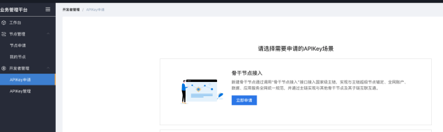

第二步：申请完成后，等待所属超级节点审核，审核完成后 可以在
APIKey管理里面查询开发者信息。

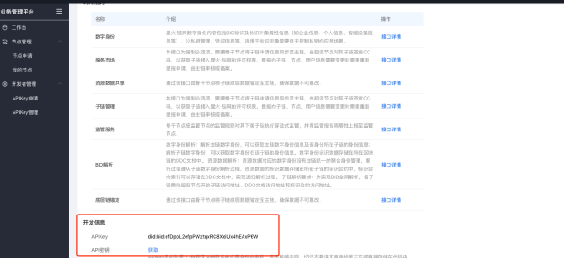

## 3.3 开发规范

骨干节点开发规范同[《星火·链网超级节点开放平台APIV1.5.2》](https://bif-open-api-doc.readthedocs.io/zh_CN/latest/index.html)目录基本一致，包含骨干节点可接入的所有功能。**骨干节点接入初期可参考本文档3.1节接入内容 查看开发规范。**

### 3.3.1 基础功能

##### 3.3.1.1 BID标识应用

BID标识是为了确保整体星火·链网体系数字身份账户、数据等规范保持一致。骨干节点系统账户体系支持BID数字身份规范，并在BID标识中添加AC号，与主链统一数字身份区分。骨干节点所在的基础子链（或骨干链）以及下属子链，需要满足BID解析协议要求实现BID标识全网解析功能，允许骨干节点及其子链用户可以向全网发送BID标识解析请求，同时响应主链及其他子链BID标识解析请求，并向请求方返回BID文档数据。

1. BID标识注册

   结合子链AC号，按照星火·链网开放的BID-SDK开发BID标识注册功能，并按照《BID协议V1.8.8》管理BID标识数据信息；

   确保骨干节点及其子链账户体系能够兼容星火·链网BID账户体系，并具备BID数字身份信息维护、私钥管理、凭证管理等功能。

2. BID标识模板同步

   将BID标识模板同步到主链，供其他用户参考使用。

3. BID标识解析

   按照BID解析协议规范，为骨干节点(或骨干链)设计BID解析功能，骨干节点的标识数据存放在其所在基础子链，通过基础子链实现BID标识全网解析能力。

##### 3.3.1.2 星火链网数字身份

星火·链网数字身份内容包括BID标识及标识对象属性信息（如企业信息、个人信息、智能设备信息等）、公私钥管理、凭证信息等，适用于标识对象需要自主控制私钥的应用场景。

1.  生成主链数字身份：子链用户在子链自生成星火·链网子链数字身份后，需要按需获取主链数字身份才能使用主链或其他子链的服务。因此，骨干节点需具备调用数字身份接口的功能，为子链BID数字身份生成一个主链全局聚合性数字身份，主子链数字身份同一私钥控制；

2.  可信认证申请：获取主链数字身份后，可通过接口进行可信认证，也可通过主链数字身份登录主链超级节点系统申请可信认证；

3.  查询可信认证申请结果：可信认证证书全网通用，可通过接口获取主链可信认证的结果，也可通过主链数字身份登录主链超级节点系统查看认证信息；

4.  凭证创建：用户通过该接口可以创建凭证，凭证创建完成后，在星火·链网管理平台审核通过后，其他用户可以申请该凭证；

5.  凭证申请：用户通过该接口可以申请凭证。

##### 3.3.1.3 底层链业务

骨干节点可以通过开放API申请新的子链。骨干节点及其子链先支持BID账户体系，再同步数据，按要求将其BID标识同步至主链；需要同步管理数据的底层链包括骨干链、骨干节点下属子链。

1、申请子链

- 子链申请：骨干节点业务系统应具备子链接入申请流程，子链接入星火·链网时需要提交申请信息，骨干节点审核完成后骨干节点签名，并以骨干节点的名义向超级节点申请AC号，AC号由超级节点签发。

- 查询子链申请状态：骨干节点可通过接口查询子链申请状态，并将新申请的AC号及时同步至骨干节点系统，供子链接入使用；

- 查询子链信息：可通过接口查询链备案信息，用于管理和维护。

2、用户备案

- 用户备案：需要将骨干节点及其下属子链用户(包括企业和个人)同步至主链备案，需按要求同步用户的BID数字身份信息；

- 活跃用户登录统计：通过该接口将骨干节点下属子链用户（该用户需在星火链主链备案）的登录记录同步至主链

3、入链审核

- 查询用户入链申请数据：主链为所有子链设计了快捷入口，用户可通过主链向骨干节点及其子链发送入链申请，骨干节点可通过接口查询跟自己相关的用户入链申请

- 用户入链申请状态同步：通过主链发送的入链申请，骨干节点需要将审核结果同步至主链用户。

4、链标识应用数据同步

- 链标识数据同步：将链的标识数据上报到主链（要求每5分钟同步一次，将5分钟内的标识数据同步上来）

- 链标识解析数据同步：将链解析标识数据记录上报到主链（要求每5分钟同步一次，将5分钟内的解析标识数据同步上来）

5、链应用服务信息同步

- 链应用服务信息同步到主链（要求每5分钟同步一次。将5分钟内的子链应用服务信息同步上来）

##### 3.3.1.4 底层链锚定

骨干节点需要把所有子链（包括骨干链）的底层链数据同步至主链，包括子链区块、交易、节点等信息，对应《星火·链网超级节点开放平台APIV1.5.2》里[底层链锚定](https://bif-open-api-doc.readthedocs.io/zh_CN/latest/docs/API%E6%8E%A5%E5%8F%A3/4-%E5%BA%95%E5%B1%82%E9%93%BE%E9%94%9A%E5%AE%9A.html)接口，具体的接口协议如下：

1、链基础信息同步

- 骨干节点将子链基础信息同步至主链 。

2、链个性化信息同步

- 不同架构的区块链需要根据其具体情况，将其个性化数据同步至主链，如fabric、以太坊等，并支持自定义配置；

3、底层链数据同步

- 链状态信息同步：将骨干链及其子链的状态信息同步到主链，状态信息包含：区块高度、参与共识的节点数量、节点总数量、系统合约数量、业务节点个数、总交易数等。需要两步操作：获取链动态信息同步交易blob；链动态信息同步提交。要求每隔5分钟同步一次数据。
- 链节点信息同步：将骨干链及其子链的所有节点信息同步到主链，链节点信息包含：节点对象集合、节点名称、节点申请时间、节点地理位置等。需要两步操作：获取链节点信息同步交易blob；链节点信息同步提交。节点有新增和修改时需要同步至主链。
- 链节点运行状态同步：将骨干链及其子链的所有节点运行状态同步到主链，节点运行状态包含：节点运行状况、节点相应时延、最新区块高度、最新区块哈希、最新交易总量等。需要两步操作：获取链节点运行状态同步交易blob；链节点运行状态同步提交。节点有新增和修改时需要同步至主链；节点地址采用BID数字身份账户体系。
- 链区块信息同步：将骨干链及其子链将链的区块信息同步到主链锚定，需要两步操作：获取链的区块信息同步blob；链的区块信息提交（上链）。有新区块生成时需实时同步。
- 链交易信息同步：将骨干链及其子链的交易上报到主链（要求每隔5分钟同步一次，将5分钟内的交易都同步上来）。

4、合约信息同步

- 链合约信息同步：骨干节点将链上合约信息同步到主链，便于备案审查。需要两步操作：获取合约信息同步blob；合约信息同步提交（上链）。要求每隔5分钟同步一次数据。

- 链智能合约调用信息同步：用于子链合约调用记录上报到主链（要求每5分钟同步一次。将5分钟内的合约调用记录数据同步上来）

- 链智能合约部署信息同步：用于子链合约部署记录上报到主链（要求每5分钟同步一次。将5分钟内的合约部署记录数据同步上来）

5、异常数据同步

- 链未打包的交易数同步：每隔一小时同步一次，同步最近24小时每小时未打包交易数，按整点取值。

- 链节点故障日志同步：用于子链节点故障信息上报到主链（要求每5分钟同步一次。将5分钟内的子链节点故障日志数据同步上来）

### 3.3.2 拓展功能

##### 3.3.2.1 服务共享

根据具体业务，将应用服务在主链共享或调用主链公共服务，详见《星火·链网超级节点开放平台APIV1.5.2》中[服务市场](https://bif-open-api-doc.readthedocs.io/zh_CN/latest/docs/API%E6%8E%A5%E5%8F%A3/5-%E6%9C%8D%E5%8A%A1%E5%B8%82%E5%9C%BA.html)章节。

1、服务共享

- 服务商认证：在「公共数据服务平台」-「星火市场」-「服务商认证」进行服务商认证申请，填写完信息并提交后等待所属超级节点进行审核。审核通过后，可以创建服务。

- 服务上架：企业在接入星火链网，并通过星火链网服务商认证后，可在服务市场，为自己的区块链服务创建对应商品。通过审核后，星火链网用户可使用主链数字身份，在服务市场购买使用此服务。

- 查询应用服务订单数据：针对星火·链网公共数据服平台上架的应用服务，服务商使用此接口可以向主链查询服务商品的售卖情订单数据，服务商需根据订单数据为用户提供对应服务。

- 同步API类服务商品的授权信息：对于API类服务服务商根据订单号，需要为购买者提供调用API服务的appId、appSecret等相关使用权限的凭证，并将凭证的信息推送给平台，平台会将该信息推给对应购买者。

- 查询API类服务商品的调用余量：需要服务提供商API调用余量给平台查询

- 用户统一授权认证：统一认证OAuth2.0授权登录让统一认证用户使用统一认证身份安全登录第三方应用或网站，在统一认证用户授权登录已接入统一认证OAuth2.0的第三方应用后，第三方可以获取到用户的接口调用凭证（access_token），通过access_token可以进行统一认证开放平台授权关系接口调用，从而可实现获取统一认证用户基本开放信息和帮助用户实现基础开放功能等。

- 统一认证流程分为三步：第三方发起统一认证授权登录请求，统一认证用户允许授权第三方应用后，统一认证会拉起应用或重定向到第三方网站，并且带上授权临时票据code参数；通过code参数加上api_key和api_secret等，通过API换取access_token；通过access_token进行接口调用，获取用户基本数据资源或帮助用户实现基本操作。

2、公共服务调用

主链面向骨干节点及其子链开放公共服务调用接口，为子链应用提供支撑。

- 主链合约部署服务：提供合约布署至主链的公共服务，便于开发者应用开发。需要将编写好的合约发布到主链上，发布完成需要超级节点进行审核，审核通过合约发布成功，合约发布申请需要两个步骤：获取合约发布blob(blob是星火链上交易结构序列化后的十六进制格式)，然后用户使用数字身份私钥blob进行签名，并将合约部署上链即可。分为两步：获取合约发布申请blob，合约发布提交（上链）
- 身份核验服务：主链提供基于预言机的身份核验公共服务，通过该接口，链上合约可以通过预言机，校验合约用户的身份，并返回核验结果。
- 公共预言机服务：主链基于预言机的公共服务。
- 秘钥管理服务：主链密钥管理公共服务。

##### 3.3.2.2 数据资源共享

通过将资源数据作为公共数据开放到主链开放资源库，实现资源数据可以被星火·链网生态全体用户按需检索和在线交易；
骨干节点需具备调用该接口的功能，子链可按需将资源数据在主链进行共享、交易。

- 数据资源上传：上传本地数据资源，后续可以在链上进行开放、共享、转移等操作

- 创建共享群组：通过输入多个bid创建群组，便于后续将数据资源共享给群组

- 数据资源共享：将数据资源共享给指定个人、群组，收到共享后可以预览该数据资源

- 开放资源申请：将数据资源开放到主链开放资源库，所有人可预览

- 查询资源状态：查询资源状态，包括未开放、审核中、已开放、已转移

##### 3.3.2.3 监管服务

骨干节点按监管节点的监管规则对其下属子链执行穿透式监管，并将监管报告周期性上报至监管节点。接口详情包括以下内容：

- 违禁词列表查询：违禁词列表是由监管节点制定，骨干节点可通过该接口查询违禁字典列表信息，并在其骨干节点及其子链系统中按照违禁词列表要求执行筛查工作，避免违禁内容上链。

- 监管报告：骨干节点向监管节点周期性同步监管报告，一周一次。

- 查询你工单列表：星火·链网中违法违规事件通过工单的形式体现，骨干节点需要按照工单规范将违法违规事件同步给监管节点，便于审查。同时，骨干节点可通过该接口向监管节点查询跟其相关的工单列表。

- 工单处理反馈：骨干节点可通过关停用户、节点、子链、合约等形式对违法违纪对象进行处置，并将处置内容以工单的形式同步至监管节点。

### 3.3.3 跨链互操作

##### 3.3.3.1 跨链接入流程说明

数据互联互通后，需要开发骨干节点与超级节点之间的跨链互操作功能，实现数据跨链、资产跨链和智能合约跨链互操作过程。骨干节点接入跨链的具体流程如下图所示：

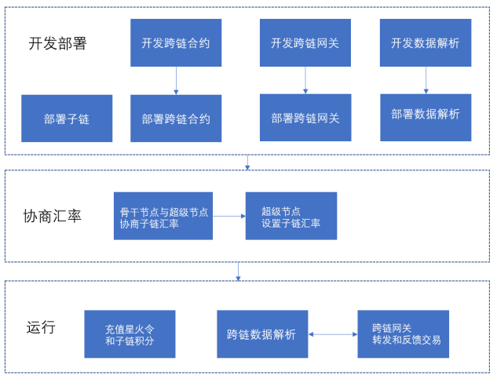

流程说明：

1.  骨干节点部署一条子链，或使用已有的子链，该子链需要支持图灵完备智能合约功能（该跨链协议也支持中心化系统，需要骨干节点按照跨链协议实现对应的接口即可，这里仅以具有智能合约的区块链为例，来阐述骨干节点接入跨链流程）

2.  骨干节点开发子链的跨链合约，该合约需要支持主链积分转移、子链积分转移、数据跨链、智能合约跨链互操作功能；

3.  骨干节点开发跨链数据解析功能，解析子链上与该跨链合约相关的所有跨链交易，解析后存储到数据库中，便于后续用户查询、数据展示、业务分析等；

4.  骨干节点在子链上部署跨链合约，初始化该子链的跨链合约数据，如子链的跨链网关账户地址、合约版本等；

5.  骨干节点开发跨链网关功能，其主链网关账户与上报子链账户一致，该网关程序主要有两大功能：一是将子链的跨链交易转发/反馈至主链跨链合约；二是将主链上与自己相关的跨链交易转发/反馈到当前子链跨链合约；

6.  骨干节点部署子链数据解析和跨链网关的程序；

7.  骨干节点与超级节点协商确定子链汇率，由超级节点设置子链积分汇率

8.  骨干节点在主链上向网关账户充值一定额度的星火令；在子链上向网关账户充值一定额度的子链积分，用于积分转移或兑换使用。

9.  跨链网关程序调用超级节点跨链API，查询跨链操作，根据主链结果，转发/反馈跨链交易到子链；

10. 跨链网关程序根据子链跨链解析服务的结果，调用超级节点API接口，转发/反馈跨链交易到主链。

备注：

-   骨干节点如果有多个子链，需要在每个子链上部署跨链合约；

-   骨干节点如果有多个子链，可以部署一个或多个跨链网关程序，具体根据网关程序的实现来部署；

-   跨链网关程序通过超级节点API调用转发跨链交易、反馈跨链交易时，需要支付星火令手续费；

-   骨干节点的网关账户上，当主链星火令或者子链积分不足时，会导致跨链交易失败。需要由骨干节点在相应的链上，向网关账户充值，质押足够星火令或者子链积分，用于保证跨链交易顺利进行。

跨链网关服务要根据当前子链的共识特性来保证交易的确认性和合法性。如pow共识类型情况下，子链数据解析服务在解析跨链数据后，需要保证在N个块确认，才认定当前交易为合法交易；在pbft情况下，只需确认1个区块即可。

##### 3.3.3.2 跨链内容规范

该跨链协议基于主子链群架构设计，解决链群之间的资产信息互联互通问题。该链群架构由一个国家主链和多个行业子链组成，这种架构可以让各个行业业务更加高效地运行在各自的子链上，这些业务相互独立且不会受到彼此影响。在该主子链群架构中，需要被跨链传递的内容包含如下：

1. 主链积分转移

   主链的积分由主链共识及其激励机制产生。激励机制是指对参与区块链共同治理节点的奖励机制，一个有效的激励模型能够提高用户参与度的积极性，从而保证了区块链系统的活跃性；因为区块链关系到所有参与者的利益，因此能够促使参与者共同维护区块链系统，防止黑客攻击，使区块链系统运行的稳定性、安全性和高效性，从而建立一个功能更加完善的区块链生态系统。

   主链的星火积分可以转在主子链群中做任意转移，主链可以转移到子链的任一账户地址中，子链的星火积分仍然可以在子链中转移给子链的其他用户，从而达到主链积分在全网中流通及使用。

1. 子链积分兑换

   子链积分由子链共识及其激励机制产生。每个子链的生态中，子链积分对生态的影响有着关键性因素。在实际的生产和商业活动中，子链积分也有着跨域使用的需求。因此需要对子链积分跨链流通和使用进行支持。

   子链积分兑换成主链积分后才能进行转移。在源链中，用户需要先找骨干节点按照汇率先兑换成对应的主链积分，转移到对端链中，由骨干节点按照目标链积分的汇率进行兑换。

1. 合约互操作

   用户调用合约，可以传递参数。

1. 数据传递

   源链传递到对端的BID合约，以BID DOC方式存储。

##### 3.3.3.3 跨链原理

如下图所示，本方案提出了中继链（主链）+平行链（子链）跨链模式，用于实现不同业务场景的跨链功能，这种模式可以保证跨链的安全性和扩展性。

本方案架构的模块包含如下内容：包括中继链（主链）、平行链（子链）、跨链网关（骨干节点网关）。中继链即现有的国家主链，国家超级节点负责维护区块链安全稳定的运行，其高效的共识算法，保证跨链的效率，满足平行链跨链对性能的不同要求。平行链是所有参与接入跨链生态的同构/异构区块链，可以是各种公链、联盟链、私链等。跨链网关是中继链和平行链的适配网关，实现平行链/中继链互联互通跨链通信，一般由骨干节点承担网关功能。

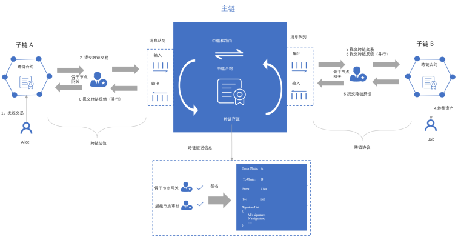

以子链A上的用户Alice向子链B上的用户Bob转移跨链资产为例，其流程如下：

1.  用户Alice向子链A跨链合约发起一笔跨链交易
1. 子链A的骨干节点网关监听到跨链交易，经过验证后跨链信息，提交跨链交易到中继链中
1. 子链B的骨干节点网监听到跨链交易，并进行校验成功后，提交跨链交易到子链B中
1. 子链B中，跨链提案共识成功后，转移资产给用户Bob。
1. 子链B的骨干节点网关监听到跨链交易成功后，向中继链提交跨链交易反馈，标示跨链反馈交易成功
1. 子链A和子链B的骨干节点网关监听到中继链跨链交易反馈成功后，分别向子链A和子链B提交跨链交易反馈，标示跨链反馈交易成功
1. 至此，跨链结束


​       主子链架构中，骨干节点在主链和子链上，负责申请创建/加入子链，当其申请的子链由超级节点审批成功后，骨干节点参与子链共识即成为子链的共识节点，并可以承担跨链网关角色。

1. 骨干节点（骨干节点网关）

   骨干节点在自己的子链上部署跨链服务，基于跨链CCP协议实现跨链网关，与主链通讯交互，并通过主链作为中继链，与其他任意子链进行跨链操作。

2. 超时机制

   基于主子链的架构中，存在多条子链，主链与每个子链，以及子链之间的时间无法保证一致性。因此会带来超时异常的问题，很难保证每个链的超时时间保持一致，为此本方案提出了基于主链的统一超时机制。任意用户在任意链上发起的交易，最终以主链的时间为基准。当主链认定某个跨链交易超时，则骨干节点会同步该消息至各个子链，从而达到不同域范围内的子链时间的一致性，进而保证跨链事务的一致性。

   时间锁（Time Locked Contract，TLC)让多个用户之间能在多条区块链之间进行资产支付。时间锁可以组成多跳支付(即双方在交易过程中可借助多个中间节点来完成交易）和原子交换（Atomic Swap），是链下支付通道和跨链交易的基础。时间锁指交易双方约定在某个时间内提交才有效，超时则承诺方案失效（无论是提出方或接受方）。

3. SEND和ACK机制

   SEND和ACK机制是任意一条发送的跨链消息，在发出后经过目标链处理完成后，必须确认给源链，源链收到确认消息后才将此跨链消息进行确认操作（如锁定、解锁、转移资产）。
   ACK消息包含三种类型：

-   成功

目标链处理完成后，骨干节点监听后，向源链发送ACK SUCEESD消息

-   失败

目标链处理异常，如交易失败，骨干节点监听后，向源链发送ACK FAILED消息

-   超时

目标链一直没有相应，骨干节点会先查询主链是否为超时状态，如果为超时，则会向源链发送ACK
TIMEOUT消息

##### 3.3.3.4 跨链通讯协议定义

|  **参数**       |  **数据类型**   |  **描述**                                                                           |
|-----------------|-----------------|-------------------------------------------------------------------------------------|
|  srcAC          |  String         |  源链的AC码                                                                         |
|  destAC         |  String         |  目标链的AC码                                                                       |
|  crossTxNo      |  String         |  跨链编号。"A:B:XXXXXXXX"，A为源AC码，B为目标AC码，XXXX为随机编码                   |
|  srcAddress     |  String         |  源地址                                                                             |
|  destAddress    |  String         |  目标地址                                                                           |
|  txType         |  String         |  交易类型，详情见以下定义                                                           |
|  payload        |  Object         |  根据交易类型定义对应的扩展信息，详情见以下定义                                     |
|  remark         |  String         |  用户备注信息                                                                       |
|  txList         |  Array          |  跨链交易数组                                                                       |
|  txList[i].hash |  String         |  跨链交易hash                                                                       |
|  status         |  String         |  跨链交易的状态。"0":初始化，"1":已确认成功, "2":已确认失败, "3":已超时，"4":已退款 |
|  result         |  String         |  跨链结果。0正在进行，1是已完成                                                     |
|  extension      |  Object         |  扩展消息。用户自定义消息                                                           |
|  version        |  String         |  协议版本号.如果版本号不兼容，则跨链交易失败                                        |

##### 3.3.3.5 跨链类型及内容定义

1.  主链积分转移（txType="0"）

|  **变量**       |  **类型**   |  **描述**     |
|-----------------|-------------|---------------|
|  payload        |  Object     |  主链积分信息 |
|  payload.amount |  String     |  积分数量     |

1.  子链积分兑换（txType="1"）

场景使用：

-   子链积分兑换成主链星火令

-   子链积分兑换成其他子链积分

-   主链星火令兑换成子链积分

骨干节点的跨链网关需要承担兑换子链积分和转移主链积分的功能。

参数说明：

|  **变量**              |  **类型**   |  **描述**                       |
|------------------------|-------------|---------------------------------|
|  payload               |  Object     |  源链积分信息                   |
|  payload.masterAmount  |  String     |  主链星火令数量                 |
|  payload.srcAmount     |  String     |  源链积分数量                   |
|  payload.srcTokenRate  |  String     |  源链积分的汇率（从主链获取）   |
|  payload.destAmount    |  String     |  目标链积分数量                 |
|  payload.destTokenRate |  String     |  目标链积分的汇率（从主链获取） |

兑换汇率换算方式如下：

```
masterAmount = srcAmount/srcTokenRate;

masterAmount = destAmount/destTokenRate;
```

1.  合约互操作（txType="2"）

|  **变量**                      |  **类型**            |  **描述**                                                                          |
|--------------------------------|----------------------|------------------------------------------------------------------------------------|
|  payload                       |  Object              |  自定义消息                                                                        |
|  payload.contractMethod        |  String              |  目标合约方法                                                                      |
|  payload.contractInput         |  Array               |  合约参数。用户自定义                                                              |
|  payload.contractInput[0]      |  Object/String/Array |  自定义参数一                                                                      |
|  payload.contractInput[n]      |  Object/String/Array |  自定义参数N                                                                       |
|  payload.token                 |  Object              | 可以为空，源链积分信息当涉及到需要支付资产时候，可以使用子链积分兑换的协议进行扩展 |
|  payload.token.masterAmount    |  String              |  主链积分数量                                                                      |
|  payload.token.srcAmount       |  String              |  源链积分数量                                                                      |
|  payload.token.srcTokenRate    |  String              |  源链积分的汇率                                                                    |
|  payload.token.destAmount      |  String              |  目标链积分数量                                                                    |
|  payload.token.destTokenRate   |  String              |  目标链积分的汇率                                                                  |

1.  数据传递（txType="3"）

源链用户发起，传递到目标链，最终以BID DOC方式存储

|  **变量**                                     |  **类型**   |  **描述**                                                                                                  |
|-----------------------------------------------|-------------|------------------------------------------------------------------------------------------------------------|
|  payload                                      |  Object     |  数据对象                                                                                                  |
|  payload.document                             |  Object     |  BID DOC对象                                                                                               |
|  payload.document.bid                         |  String     |  bid为具体的bid标识                                                                                        |
|  payload.document.publicKey[]                 |  Array      |  标识did拥有者公钥数组                                                                                     |
|  payload.document.publicKey[i].id             |  String     |  id\#keys-i的格式，用来标识did拥有者。如：did:bid:ZUZQkYXw6f87t3JkHCr2MauQAzYB2zM1s\#keys-1                |
|  payload.document.publicKey[i].type           |  String     |  Ed25519，目前只支持Ed25519                                                                                |
|  payload.document.publicKey[i].publicKeyHex   |  String     |  拥有者公钥                                                                                                |
|  payload.document.type                        |  String     |  具体标识的物体类型比如图像(image)、声音（voice）、视屏(video)、汽车(car)、手机(phone)、标识（handle）等   |
|  payload.document.recovery                    |  Array      |  修改权限控制列表                                                                                          |
|  payload.document.recovery[i]                 |  String     |  为恢复秘钥标识。如did:bid:ZUZQkYXw6f87t3JkHCr2MauQAzYB2zM1s\#keys-1                                       |
|  payload.document.service                     |  Object     |  标识依赖的服务对象                                                                                        |
|  payload.document.service.id                  |  String     |  bid\#resolver                                                                                             |
|  payload.document.service.type                |  String     |  DIDResolve                                                                                                |
|  payload.document.serviceEndpoint             |  String     |  DID解析地址                                                                                               |
|  payload.document.attributes                  |  Array      |  属性信息，创建地址的时候可以不用传入                                                                      |
|  payload.document.attributes[i].key           |  String     |  关键字标识                                                                                                |
|  payload.document.attributes[i].type          |  String     |  是否加密，加密为encrypt，未加密为空""                                                                     |
|  payload.document.attributes[i].value         |  String     |  若是加密状态则值为空，若是明文状态为具体的值                                                              |
|  payload.document.encryptEndpoint             |  String     |  解密服务地址                                                                                              |
|  payload.document.fileEndpoint                |  String     |  文件存储地址                                                                                              |
|  payload.proof                                |  Object     |  证据对象                                                                                                  |
|  payload.proof.type                           |  String     |  为签名算法类型默认为Ed25519                                                                               |
|  payload.proof.creator                        |  String     |  id\#keys-1                                                                                                |
|  payload.proof.signatureValue                 |  String     |  签名信息，签名的具体内容为document相加，让后用创建者（变更者）BID私钥进行签名                             |

##### 3.3.3.6 开发子链跨链合约

骨干节点如果是一条链的情况下，需要开发和部署子链跨链合约，接口包含如下：

（1）发起跨链交易

功能：

用户发起跨链交易（类型为主链积分、子链积分、合约资产、数据传递），目标链为主链或者其他子链。

以下为伪代码接口和及参数：

```json
{

"method": "startTx",

"params":{

"srcAddress": "",

"destAddress": "",

"destAC": "",

"txType": "",

"payload":{

},

"remark": "",

"extension": {},

"version": ""

}

}
```

请求参数说明：

|  **变量**      |  **类型**   |  **描述**                                                       |
|----------------|-------------|-----------------------------------------------------------------|
|  srcAddress    |  String     |  源地址                                                         |
|  destAddress   |  String     |  目标地址                                                       |
|  destAC        |  String     |  目标链的AC码                                                   |
|  txType        |  String     |  交易类型。参照跨链数据格式定义                                 |
|  payload       |  Object     |  根据交易类型定义对应的扩展信息。参照跨链数据格式定义           |
|  extension     |  Object     |  用户扩展信息                                                   |
|  remark        |  String     |  备注信息                                                       |
|  version       |  String     |  版本信息，由原始用户发起交易携带，填写源链跨链合约的版本信息   |

（2）转发跨链交易

功能：

骨干节点通过超级节点API，监听到主链或者其他子链上有与自己相关的首次交易，需要构建转发跨链交易，触发当前子链的跨链合约。

以下为伪代码接口和及参数：

```json
{

"method": "sendTx",

"params":{

"srcAddress": "",

"destAddress": "",

"srcAC": "",

"destAC": "",

"txType": "",

"payload":{},

"remark": "",

"extension": {},

"version": ""

}

}
```

请求参数说明：

|  **变量**    |  **类型**   |  **描述**                                                       |
|--------------|-------------|-----------------------------------------------------------------|
|  srcAddress  |  String     |  源地址                                                         |
|  destAddress |  String     |  目标地址                                                       |
|  srcAC       |  String     |  源链的AC码                                                     |
|  destAC      |  String     |  目标链的AC码                                                   |
|  txType      |  String     |  交易类型。参照跨链数据格式定义                                 |
|  payload     |  Object     |  根据交易类型定义对应的扩展信息。参照跨链数据格式定义           |
|  extension   |  Object     |  用户扩展信息                                                   |
|  version     |  String     |  版本信息，由原始用户发起交易携带，填写源链跨链合约的版本信息   |
|  remark      |  String     |  备注信息                                                       |

（3）反馈跨链交易

功能：

骨干节点通过超级节点API，监听与当前子链相关的跨链交易，如果主链上的跨链交易的状态发生变化时，需要构建子链上的跨链确认交易，触发子链跨链合约。以下为伪代码接口和及参数：

```json
{

"method": "sendAcked",

"params":{

"crossTxNo": "",

"result": "",

"extension": {},

"version": ""

}

}
```

请求参数说明：

|  **变量**    |  **类型**   |  **描述**                                                       |
|--------------|-------------|-----------------------------------------------------------------|
|  crossTxNo   |  String     |  跨链交易编号                                                   |
|  result      |  String     |  跨链交易结果。"0"成功，"1"失败，"2":"超时"                     |
|  extension   |  Object     |  用户扩展信息                                                   |
|  version     |  String     |  版本信息，由原始用户发起交易携带，填写源链跨链合约的版本信息   |

（4）提取失败的跨链资产

功能：

用户在发起跨链交易异常（失败或者超时）后，可以主动取出资产。

以下为伪代码接口和及参数：

```json
{

"method": "takeOut",

"params":{

"crossTxNo": "",

"toBid": "",

"payload": {}

}

}
```

请求参数说明：

|  **变量**                   |  **类型**              |  **描述**                                              |
|-----------------------------|------------------------|--------------------------------------------------------|
|  crossTxNo                  |  String                |  跨链交易编号                                          |
|  toBid                      |  String                |  取出跨链资产后要转移的目标地址。                      |
|  payload                    |  Object/Array/String   |  可以为空。如果toBid是合约的话，需要自定义合约的参数   |
|  payload.contractMethod     |  String                |  目标合约方法                                          |
|  payload.contractInput      |  Array                 |  合约参数。用户自定义                                  |
|  payload.contractInput[0]   |  Object/String/Array   |  合约参数自定义参数一                                  |
|  payload.contractInput[n]   |  Object/String/Array   |  自定义参数N                                           |

##### 3.3.3.7 开发跨链网关服务

跨链网关具备转移跨链交易的功能。其同时监听主和子链跨链交易，当检测到跨链交易事件后，根据业务类型，构建对端链相应的交易，并上链。

（1）监听主链跨链交易

跨链网关通过超级节点API接口，监听和读取与当前子链相关的跨链交易，详情参考《星火·链网超级节点开放平台APIV1.5.2》中[跨链服务接入](https://bif-open-api-doc.readthedocs.io/zh_CN/latest/docs/API%E6%8E%A5%E5%8F%A3/8-%E8%B7%A8%E9%93%BE%E6%9C%8D%E5%8A%A1%E6%8E%A5%E5%85%A5.html)章节。

（2）转发/反馈跨链交易到子链跨链合约

跨链网关监听与当前子链相关的跨链交易后，根据跨链状态定义，向子链跨链合约发起转发/返回跨链交易。

（3）监听子链跨链交易

跨链网关查询子链的跨链交易数据。

（4）转发/反馈跨链交易到主链跨链合约

跨链网关监听子链上跨链交易后，根据跨链状态定义，向主链跨链合约发起转发/返回跨链交易。详情参考《星火·链网超级节点开放平台APIV1.5.2》中[跨链服务接入](https://bif-open-api-doc.readthedocs.io/zh_CN/latest/docs/API%E6%8E%A5%E5%8F%A3/8-%E8%B7%A8%E9%93%BE%E6%9C%8D%E5%8A%A1%E6%8E%A5%E5%85%A5.html)章节。

##### 3.3.3.8 跨链数据流时序图

跨链的数据流向分为三种场景，一是主链到子链方向的跨链；二是子链到主链方向的跨链；三是子链到其他子链的跨链。无论是积分转移、兑换、合约互操作、数据转移任何一种类型的跨链，都会在这三种场景下，进行数据流向。我们将抽象成统一类型的数据流，来阐述跨链过程。

- 主链到子链的跨链

  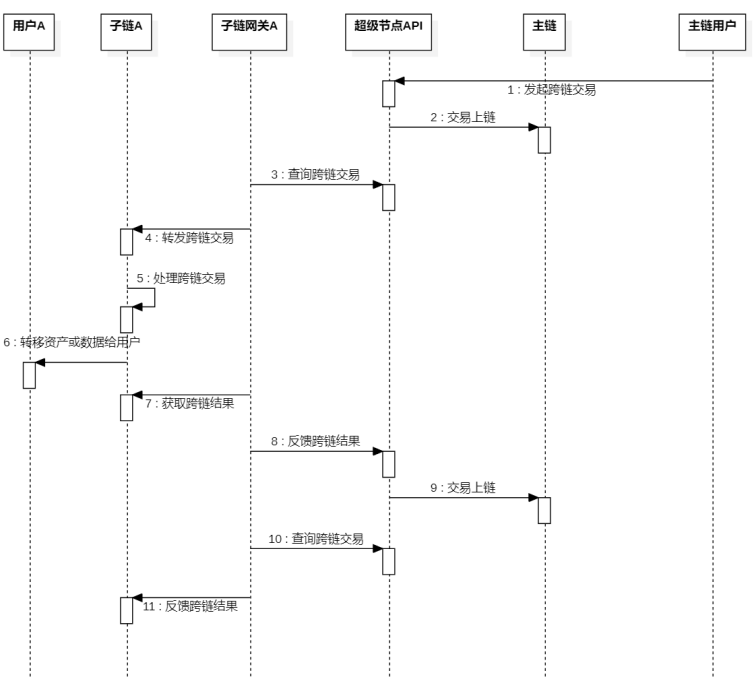

  1. 主链用户通过超级节点API，发起跨链交易，源链为主链，目标链是子链A，目标用户为子链A下的用户A；
  1. 超级节点API接收到跨链交易后，将交易转发到主链；
  1. 子链网关A查询到与自己相关的跨链交易；
  1. 构建跨链交易，发送到子链A的跨链合约上；
  1. 子链A的跨链合约处理跨链交易；
  1. 子链A的跨链合约，判断如果有资产或者数据，将会把资产转移给用户；
  1. 子链网关A获取子链A的跨链结果；
  1. 子链网关根据交易结果，构建一笔跨链交易（结果为成功或者失败），通过超级节点API反馈给主链；
  1. 超级节点API将交易转发到主链；
  1. 子链网关A查询到主链上跨链反馈结果；
  1. 子链网关A构建反馈的跨链交易，发送到子链A上。

- 子链到主链的跨链

  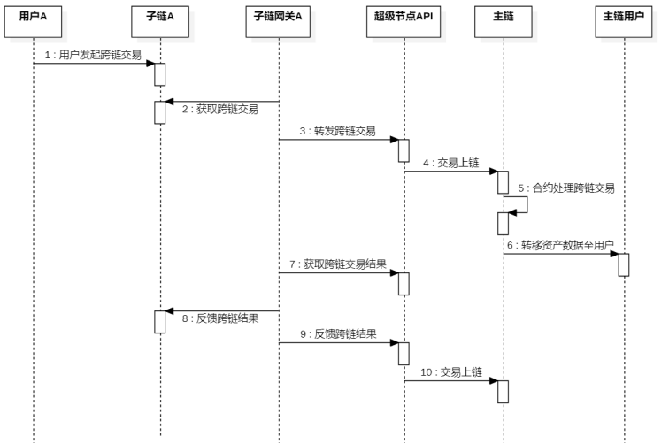

  1. 子链用户A发起跨链交易，源链为子链A，目标链是主链，目标用户为主链下的用户；
  1. 子链网关A获取跨链交易；
  1. 子链网关A根据跨链交易，通过超级节点API，构建一笔主链的跨链交易，并通过超级节点API转发跨链交易；
  1. 超级节点API转发交易到主链，交易上链；
  1. 主链跨链合约处理跨链交易；
  1. 如果涉及到资产、数据，将会转移给目标用户；
  1. 子链网关A通过超级节点API获取跨链执行结果；
  1. 子链网关A根据结果，构建子链A上的反馈跨链交易（成功或者失败）
  1. 子链网关A根据结果，构建主链的反馈跨链交易（成功或者失败），并通过超级节点API发送到主链；
  1. 超级节点API将交易上链

- 子链到其他子链的跨链

  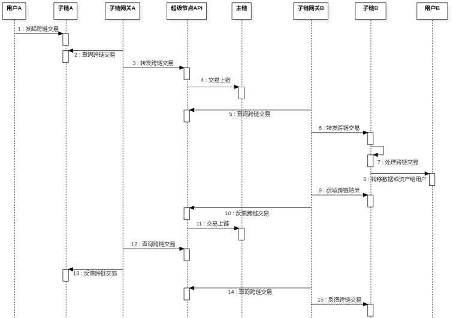

1. 子链用户A发起跨链交易，源链为子链A，目标链是子链B，目标用户为子链B下的用户B；
1. 子链网关A，在主链A上查询到跨链交易；
1. 子链网关A根据跨链交易，通过超级节点API，构建一笔主链的跨链交易，并通过超级节点API转发跨链交易；
1. 超级节点API转发交易到主链，交易上链；
1. 子链网关B获取与自己子链B相关的跨链交易；
1. 子链网关B构建一笔跨链交易，转发到子链B的跨链合约
1. 子链跨链合约处理跨链交易；
1. 如果涉及到资产、数据，将会转移给目标用户；
1. 子链网关B获取子链B上的跨链交易结果；
1. 子链网关B根据结果，构建主链的反馈跨链交易（成功或者失败），并通过超级节点API发送到主链；
1. 超级节点API会将交易上链，触发主链合约。
1. 子链网关A通过超级节点API获取跨链执行结果；
1. 子链网关A根据结果，构建子链A上的反馈跨链交易（成功或者失败）
1. 子链网关B通过超级节点API获取跨链执行结果；
1. 子链网关B根据结果，构建子链B上的反馈跨链交易（成功或者失败）；

# 4 常见问题

## 4.1 注册申请

1.  可信认证申请、节点申请等，长时间处于审核中。

    联系信通院同事加快审核。

2.  没有参考文档，或参考文档不是最新版。

    联系信通院同事。

3.  企业可信认证时，一定要上传真实的授权书吗？

    测试期间不需要。

4.  申请骨干节点时填写子链信息，AC号填写什么？

    AC号即链码，申请时可自定义，最终以超级节点审核结果为准（超级节点审核时可修改AC号）。

## 4.2 API调用

1.  网关如何激活？

    网关节点地址需要在主链上激活，请联系信通院同事。

2.  调用接口时，报错“余额不足”。

    部分接口调用需要消耗星火令，提示余额不足时，请联系信通院同事。

3.  fabric的底层架构中，有多个通道。同步区块高度是指最高通道高度？

    是的。

4.  链运行状态是为什么是“部署中”或者“运行异常”？

    需要定期同步链状态信息，每隔5分钟上报一次。
